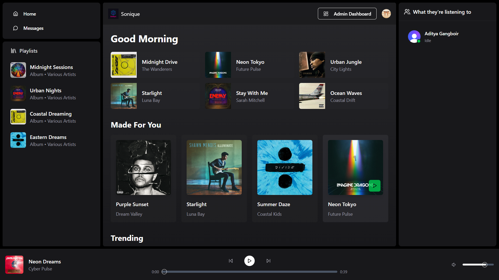
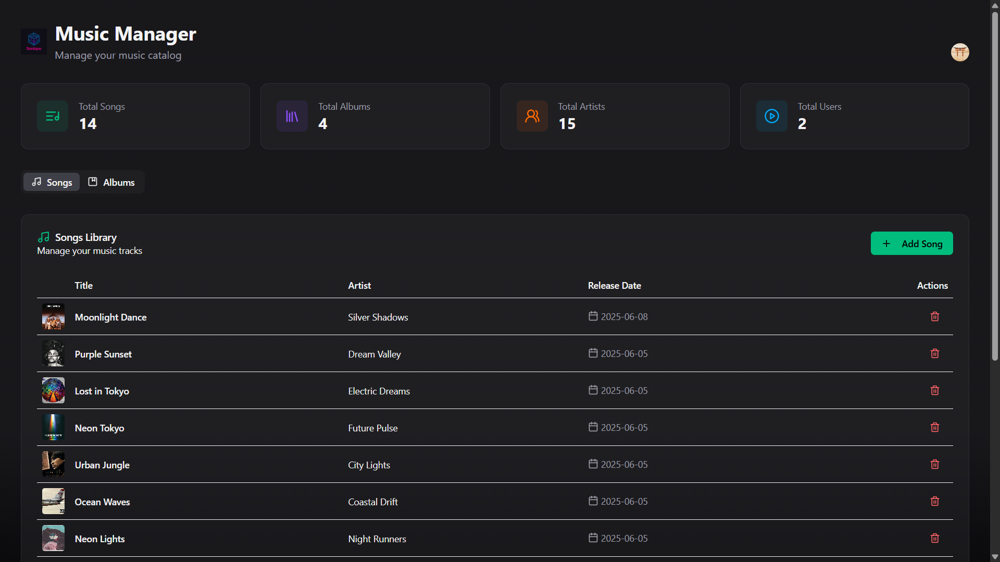
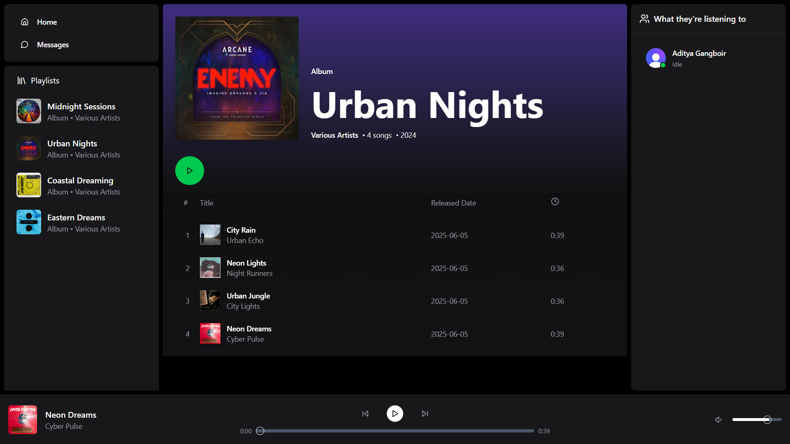
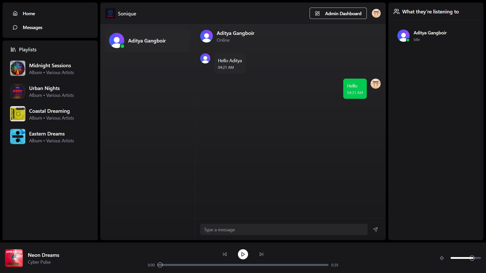

You can view the site through this link: https://sonique.onrender.com/

🎧 Welcome to Sonique – A Modern Music Streaming Platform Hello music lovers! 🎵

Sonique is a full-featured, real-time music streaming web application that lets users play music, browse albums, and chat live — all within a beautifully designed and responsive interface.

Whether you're here to enjoy tracks, explore albums, or interact with other users, Sonique brings it all together in one seamless experience.

🔧 Tech Behind the Scenes:
This web application is built using a modern full-stack stack:

TypeScript + JavaScript – for reliable and scalable development

React.js – for building the frontend interface

Node.js + Express – for backend APIs

MongoDB – to store music data, albums, and user information

Socket.IO – for real-time messaging

Clerk – for secure authentication and user management

Vite – fast and optimized build system

Shadcn/UI + Tailwind CSS – to build sleek, responsive, and accessible UIs

Cloudinary - For storing musics and albums

✨ Key Features:

🎵 Stream high-quality music directly from the homepage

📀 Browse and explore albums with beautiful UI

🔧 Admin panel to upload music and manage albums

💬 Real-time chat with other users using Socket.IO

🔐 Secure login/signup with Clerk authentication

⚡ Fast page loads with optimized performance using Vite

🎨 Fully responsive and clean design using Shadcn and Tailwind

📸 Screenshots of the Web App:

🎧 Music Streaming Home Page- The Home Page is your music dashboard. Users can browse featured songs, start playback instantly, and enjoy a fluid streaming experience. 

🛠️ Admin Page- Admins can securely access this page to upload new tracks, create albums, and manage music content on the platform. 

💿 Album Page- Shows a curated list of songs in each album. Users can click to play individual tracks or shuffle through an entire album. 

💬 Messaging Page- Real-time chat feature where users can talk, suggest tracks, or just hang out while listening to their favorite music. 

📌 Why I Built Sonique:

I built Sonique as a passion project to combine music and technology. My goal was to create an interactive, real-time platform where people can not only stream music but also communicate and share the moment with others.

This project reflects everything I've learned about full-stack development — from React on the frontend, to Node/Express on the backend, and real-time WebSocket communication using Socket.IO.

🛠️ Future Improvements:

🌐 Music search & filter system

❤️ Like/favorite functionality

🎼 Create & manage playlists

📊 Listening history & analytics

🧑‍🤝‍🧑 User profiles & avatars

Thanks for checking out Sonique! If you like the project, give it a ⭐️ on GitHub and feel free to fork or contribute!

Happy streaming! 🚀🎶